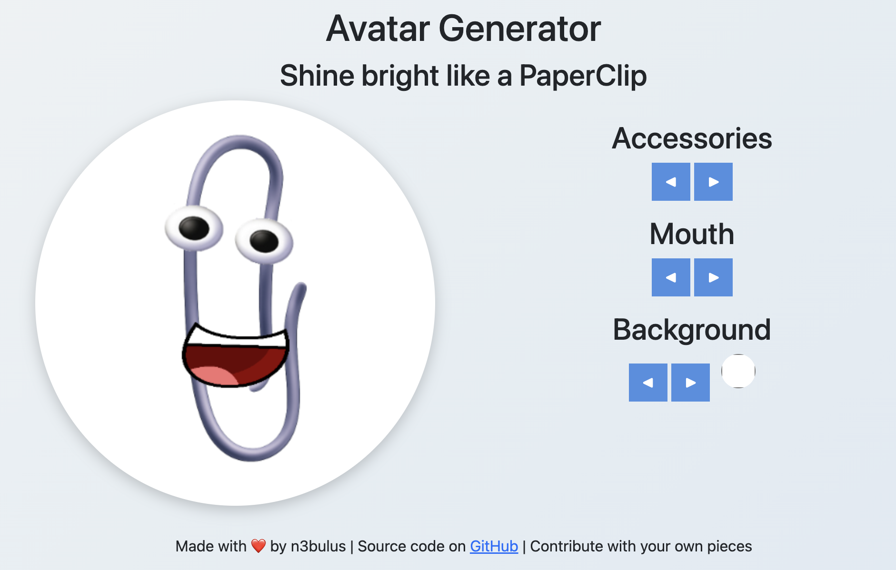

# 📎 Paperclip Avatar Generator

A fun web-based avatar builder inspired by the [youtube video](https://www.youtube.com/watch?v=2_Dtmpe9qaQ) of [Louis Rossmann](https://www.youtube.com/@rossmanngroup).

Mix and match accessories, backgrounds, and more to create your own custom Clippy avatar.



---

## 🚀 Features
- 🖼️ **Drag & drop** or **click to rotate** between available accessories.
- 🎨 **Custom backgrounds** or solid background colors.
- 😁 Support for **mouths**, **eyes**, and more.
- 🌀 Accessory rotation between multiple variants.
- 📱 Responsive layout with a rounded profile preview.

---

## 📂 Project Structure
```yaml
assets/
├── accessories/ # All accessory images (1.png, 2.png, ...)
├── mouths/ # Mouth variations (1.png, 2.png, ...)
└── backgrounds/ # Backgrounds (1.png, 2.png, ...)
scripts/
├── main.js # Main app logic
├── accessories.js # Accessory switching logic
├── mouths.js # Mouth switching logic
└── backgrounds.js # Background switching logic
index.html # Main Webpage
styles.css # Main stylesheet
```

---

## 🛠️ Getting Started

### 1. Clone the repo
```bash
git clone https://github.com/n3bulus/n3bulus.github.io.git
cd n3bulus.github.io
```

### 2. Open in your browser
No build step required, just open `index.html` in your browser.

## 🎨 Contributing Assets
See CONTRIBUTION.MD

## 🔍 Automatic Asset Renumbering
This repo has a GitHub Action that checks PRs for correct numbering.

If filenames are incorrect in a PR, the Action will leave inline suggestions so you can fix them by clicking "Apply suggestion" in the PR.

## 📜 License
This project is licensed under the MIT License.

Feel free to fork, remix, contribute and share your own Clippy creations!

## ❤️ Credits
Clippy belongs to Microsoft. This project is a fan creation for fun and nostalgia.

It feels right that most of the code was generated by ChatGPT, as a tribute to his father Clippy
